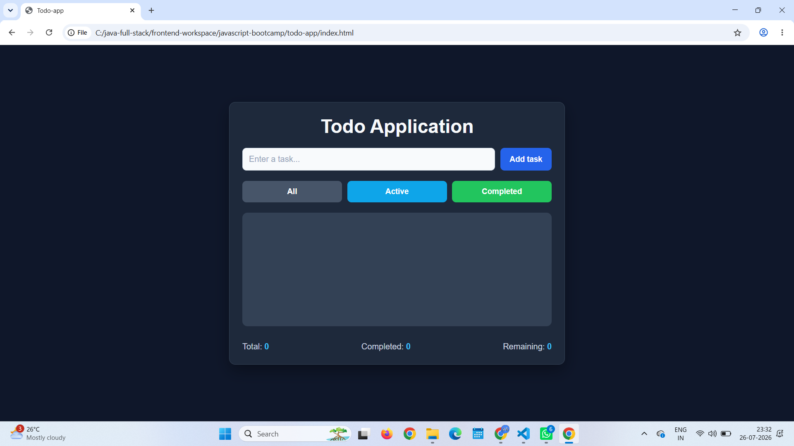
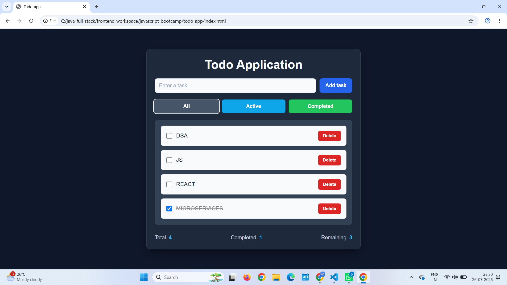
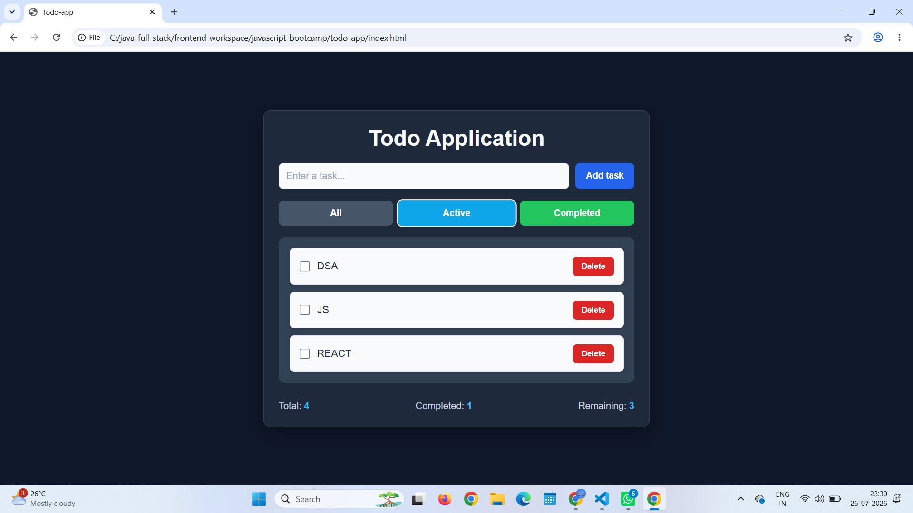

# 📝 Todo Application

A modern and responsive Todo Application built using **HTML**, **CSS**, and **Vanilla JavaScript**.

This project demonstrates CRUD operations, DOM manipulation, local storage, filtering, and responsive UI design.

---

## 🚀 Features

- ✅ Add Tasks
- ✅ Delete Tasks
- ✅ Mark Tasks as Completed
- ✅ Filter Tasks
  - All
  - Active
  - Completed
- ✅ Persistent Data using Local Storage
- ✅ Responsive UI
- ✅ Modern Dark Theme

---

## 🛠 Tech Stack

- HTML5
- CSS3
- JavaScript (ES6)

---

## 📸 Screenshots

### Home



---

### Add Task



---

### Completed Task


---

### Active Filter



---


## 📂 Project Structure

```
todo-app/
│
├── index.html
├── style.css
├── script.js
├── README.md
└── images/
```

---

## 💡 Concepts Practiced

- DOM Manipulation
- Event Listeners
- Arrays & Objects
- CRUD Operations
- Local Storage
- Dynamic Rendering
- JavaScript Functions
- Filtering
- Responsive Design

---

## ▶️ Run Locally

Clone the repository

```bash
git clone <repository-url>
```

Open the project folder

```bash
cd todo-app
```

Run using **Live Server** in VS Code.

---

## 📖 Future Enhancements

- Edit Tasks
- Task Categories
- Due Dates
- Drag & Drop Sorting
- Dark / Light Theme Toggle

---

## 👩‍💻 Author

**Sushmitha Katika**

- GitHub: https://github.com/sushmitha-katika-dev
- LinkedIn: https://www.linkedin.com/in/sushmitha-katika/